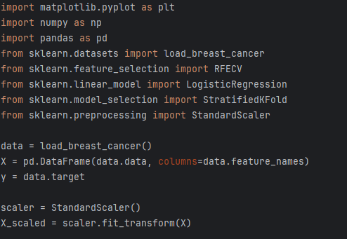
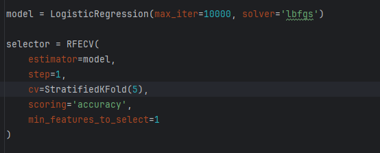
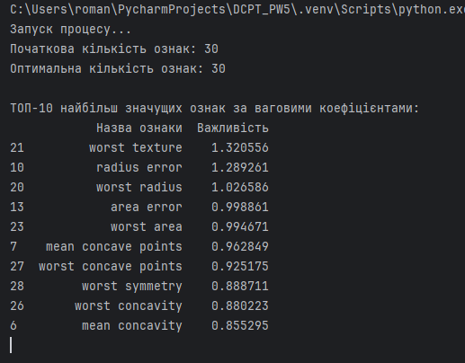
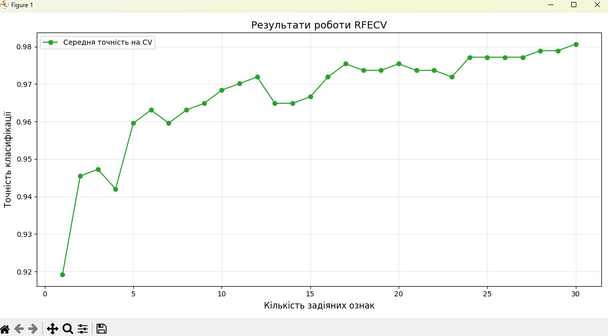

# Практична робота №5
Цей репозиторій cтворений для перегляду виконання практичної роботи №5 з дисципліни "Технології збору та обробки даних", виконане студентом Щур Р.І., групи ТВ-32.

## Мета роботи:
Вибір важливих ознак за допомогою Recursive Feature Elimination (RFE): Реалізувати метод Recursive Feature Elimination для вибору найбільш значущих ознак у даних.

## Програмна реалізація:

В якості робочих даних, було використано Breast Cancer Wisconsin, цей набір даних містить 30 числових ознак. Оскільки вхідні характеристики мають різний масштаб, то було виконано масштабування ознак за допомогою StandardScaler. Це перетворення приводить дані до вигляду із нульовим середнім значенням та одиничною дисперсією, що дозволяє лінійній моделі логістичної регресії коректно оцінювати вклад кожного параметра. 

В ролі базової моделі виступає логістична регресія, яка на кожній ітерації тренується на поточному наборі ознак та обчислює їхні вагові коефіцієнти. Алгоритм працює за принципом зворотного виключення: він ранжує ознаки за їхньою важливістю та крок за кроком видаляє найменш значущі з них. Використання StratifiedKFold на 5 фолдів, дозволило процесу вибору супроводжуватися постійною перевіркою точності на незалежних частинах даних. Це дозволяє алгоритму не просто видаляти ознаки, а знайти ту конкретну кількість характеристик, при якій модель досягає максимальної узагальнюючої здатності, уникаючи перенавчання.

## Аналіз результатів:

Алгоритм визначив математичний оптимум у 30 ознак з точністю >98%. Графік показав, що основний приріст точності відбувається на перших 5-10 ознаках. Найважливішими факторами визначено worst texture, radius error та worst radius, які мають найбільші вагові коефіцієнти.

